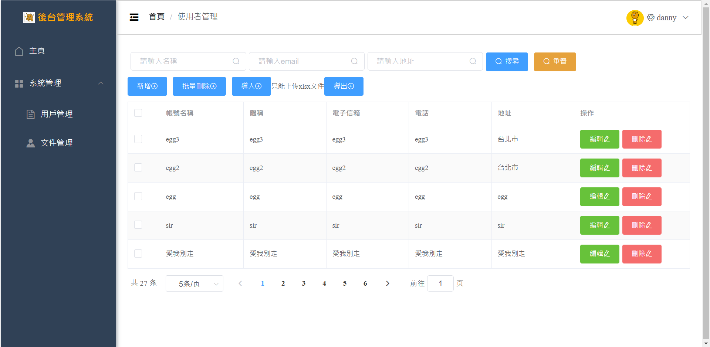

# 使用Springboot+vuejs建立一個後台管理系統
## 使用技術棧
+ vuejs
+ vue router
+ axios
+ ElementUI
+ springboot
+ mybatis
+ mybatis plus
+ jwt encoder

## 功能敘述；
+ 使用postman進行增刪改查
+ 使用vue前端打API進行增刪改查
+ 使用jwt token進行登入
+ 登入頁面+功能
+ 註冊頁面+功能
+ 分頁顯示
+ 搜尋關鍵字
+ User管理頁面
  + 導入Excel
  + 導出Excel
  + 批次刪除

## 目前前端畫面

## 目前後端接口
## User
+ 