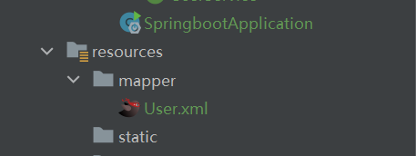
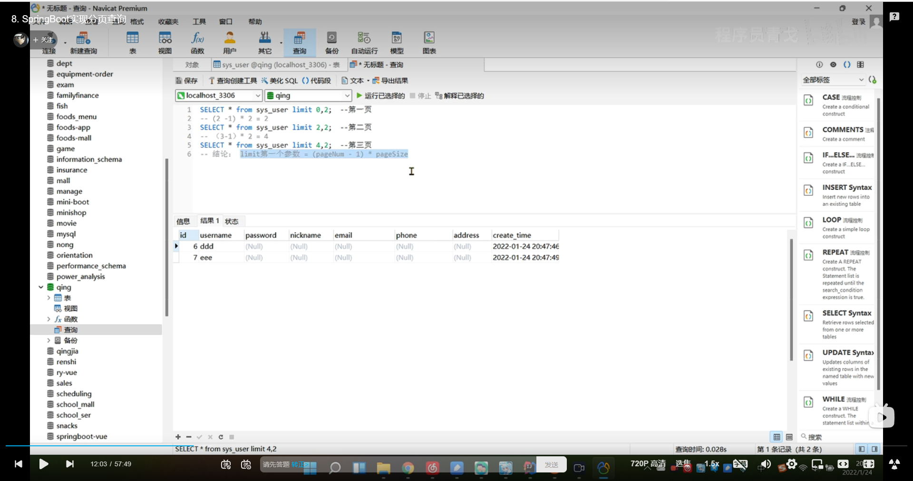
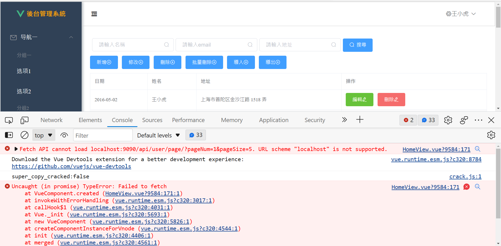
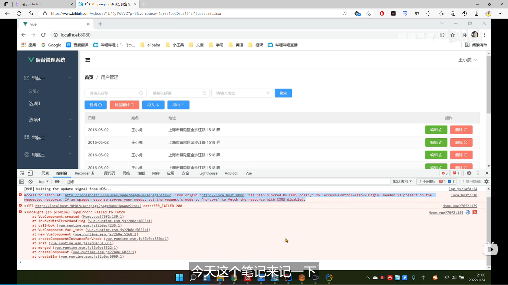
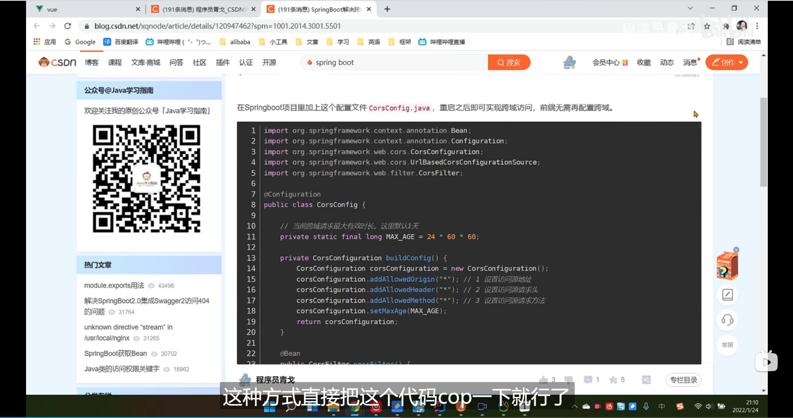

# 第一節 Vue2集成ElementUI

vue-cli 安裝 : npm install -g@vue/cli
創建vue項目 : vue create vue

運行vue項目 :

```bash
cd vue
npm run serve
```

# 第二節 Vue後台主體框架搭建

Homeview.vue

```vue

<template>
  <div class="home">
    <el-container style="height: 100%; border: 1px solid #eee">
      <!--      側邊欄-->
      <el-aside width="200px" style="background-color: rgb(238, 241, 246); height:100%;">
        <el-menu :default-openeds="['1', '3']">
          <el-submenu index="1">
            <template slot="title"><i class="el-icon-message"></i>导航一</template>
            <el-menu-item-group>
              <template slot="title">分组一</template>
              <el-menu-item index="1-1">选项1</el-menu-item>
              <el-menu-item index="1-2">选项2</el-menu-item>
            </el-menu-item-group>
            <el-menu-item-group title="分组2">
              <el-menu-item index="1-3">选项3</el-menu-item>
            </el-menu-item-group>
            <el-submenu index="1-4">
              <template slot="title">选项4</template>
              <el-menu-item index="1-4-1">选项4-1</el-menu-item>
            </el-submenu>
          </el-submenu>
          <el-submenu index="2">
            <template slot="title"><i class="el-icon-menu"></i>导航二</template>
            <el-menu-item-group>
              <template slot="title">分组一</template>
              <el-menu-item index="2-1">选项1</el-menu-item>
              <el-menu-item index="2-2">选项2</el-menu-item>
            </el-menu-item-group>
            <el-menu-item-group title="分组2">
              <el-menu-item index="2-3">选项3</el-menu-item>
            </el-menu-item-group>
            <el-submenu index="2-4">
              <template slot="title">选项4</template>
              <el-menu-item index="2-4-1">选项4-1</el-menu-item>
            </el-submenu>
          </el-submenu>
          <el-submenu index="3">
            <template slot="title"><i class="el-icon-setting"></i>导航三</template>
            <el-menu-item-group>
              <template slot="title">分组一</template>
              <el-menu-item index="3-1">选项1</el-menu-item>
              <el-menu-item index="3-2">选项2</el-menu-item>
            </el-menu-item-group>
            <el-menu-item-group title="分组2">
              <el-menu-item index="3-3">选项3</el-menu-item>
            </el-menu-item-group>
            <el-submenu index="3-4">
              <template slot="title">选项4</template>
              <el-menu-item index="3-4-1">选项4-1</el-menu-item>
            </el-submenu>
          </el-submenu>
        </el-menu>
      </el-aside>

      <el-container>
        <!--        頂部-->
        <el-header style="text-align: right; font-size: 12px;border: 1px solid #ccc; line-height: 60px;">
          <el-dropdown>
            <i class="el-icon-setting" style="margin-right: 15px"></i>
            <el-dropdown-menu slot="dropdown">
              <el-dropdown-item>查看</el-dropdown-item>
              <el-dropdown-item>新增</el-dropdown-item>
              <el-dropdown-item>删除</el-dropdown-item>
            </el-dropdown-menu>
          </el-dropdown>
          <span>王小虎</span>
        </el-header>

        <!--  主要區域-->
        <el-main>
          <el-table :data="tableData">
            <el-table-column prop="date" label="日期" width="140">
            </el-table-column>
            <el-table-column prop="name" label="姓名" width="120">
            </el-table-column>
            <el-table-column prop="address" label="地址">
            </el-table-column>
          </el-table>
        </el-main>
      </el-container>
    </el-container>
  </div>
</template>

<script>
// @ is an alias to /src
import HelloWorld from '@/components/HelloWorld.vue'

export default {
  name: 'HomeView',
  components: {}, data() {
    const item = {
      date: '2016-05-02',
      name: '王小虎',
      address: '上海市普陀区金沙江路 1518 弄'
    };

    return {
      msg: "hello 青哥哥",
      tableData: Array(20).fill(item)
    }
  }
}
</script>

```

main.js

```javascript
import Vue from 'vue'
import App from './App.vue'
import router from './router'
import store from './store'
import ElementUI from 'element-ui';
import 'element-ui/lib/theme-chalk/index.css';
import './assets/global.css';

Vue.config.productionTip = false
Vue.use(ElementUI, {size: "small"});

new Vue({
    router,
    store,
    render: h => h(App)
}).$mount('#app')


```

global.css

```css
html, body, div {
    margin: 0px;
    padding: 0px;


}

html, body {
    height: 100%;

}
```

# 第三節 Vue後台整體布局完善1

global.css

```css
* {
    margin: 0px;
    padding: 0px;
    box-sizing: border-box;
}
```

在HomeView.vue中的<el-header>增加

```vue

<div style="flex:1;font-size: 25px">
<span :class="collapseBtnClass" style="cursor:pointer" @click="collapse"></span>
</div>
```

完整檔案

```vue

<template>
  <div class="home">
    <el-container style=" border: 1px solid #eee">
      <!--      側邊欄-->
      <el-aside width="200px" style="background-color: rgb(238, 241, 246);">
        <el-menu :default-openeds="['1', '3']" style="min-height: 100vh; overflow-x: hidden"
                 background-color="rgb(48,65,86)"
                 text-color="#fff"
                 active-text-color="#ffd04d"
                 :collapse-transition="false"
        >
          <el-submenu index="1">
            <template slot="title"><i class="el-icon-message"></i>导航一</template>
            <el-menu-item-group>
              <template slot="title">分组一</template>
              <el-menu-item index="1-1">选项1</el-menu-item>
              <el-menu-item index="1-2">选项2</el-menu-item>
            </el-menu-item-group>
            <el-menu-item-group title="分组2">
              <el-menu-item index="1-3">选项3</el-menu-item>
            </el-menu-item-group>
            <el-submenu index="1-4">
              <template slot="title">选项4</template>
              <el-menu-item index="1-4-1">选项4-1</el-menu-item>
            </el-submenu>
          </el-submenu>
          <el-submenu index="2">
            <template slot="title"><i class="el-icon-menu"></i>导航二</template>
            <el-menu-item-group>
              <template slot="title">分组一</template>
              <el-menu-item index="2-1">选项1</el-menu-item>
              <el-menu-item index="2-2">选项2</el-menu-item>
            </el-menu-item-group>
            <el-menu-item-group title="分组2">
              <el-menu-item index="2-3">选项3</el-menu-item>
            </el-menu-item-group>
            <el-submenu index="2-4">
              <template slot="title">选项4</template>
              <el-menu-item index="2-4-1">选项4-1</el-menu-item>
            </el-submenu>
          </el-submenu>
          <el-submenu index="3">
            <template slot="title"><i class="el-icon-setting"></i>导航三</template>
            <el-menu-item-group>
              <template slot="title">分组一</template>
              <el-menu-item index="3-1">选项1</el-menu-item>
              <el-menu-item index="3-2">选项2</el-menu-item>
            </el-menu-item-group>
            <el-menu-item-group title="分组2">
              <el-menu-item index="3-3">选项3</el-menu-item>
            </el-menu-item-group>
            <el-submenu index="3-4">
              <template slot="title">选项4</template>
              <el-menu-item index="3-4-1">选项4-1</el-menu-item>
            </el-submenu>
          </el-submenu>
        </el-menu>
      </el-aside>

      <el-container>
        <!--        頂部-->
        <el-header style="text-align: right; font-size: 12px;border: 1px solid #ccc; line-height: 60px;">
          <div style="flex:1;font-size: 18px">
            <span :class="collapseBtnClass" style="cursor:pointer" @click="collapse"></span>
          </div>

          <el-dropdown>
            <i class="el-icon-setting" style="margin-right: 15px"></i>
            <el-dropdown-menu slot="dropdown">
              <el-dropdown-item>查看</el-dropdown-item>
              <el-dropdown-item>新增</el-dropdown-item>
              <el-dropdown-item>删除</el-dropdown-item>
            </el-dropdown-menu>
          </el-dropdown>
          <span>王小虎</span>
        </el-header>

        <!--  主要區域-->
        <el-main>
          <el-table :data="tableData">
            <el-table-column prop="date" label="日期" width="140">
            </el-table-column>
            <el-table-column prop="name" label="姓名" width="120">
            </el-table-column>
            <el-table-column prop="address" label="地址">
            </el-table-column>
          </el-table>
        </el-main>
      </el-container>
    </el-container>
  </div>
</template>

<script>
// @ is an alias to /src
import HelloWorld from '@/components/HelloWorld.vue'

export default {
  name: 'HomeView',
  components: {}, data() {
    const item = {
      date: '2016-05-02',
      name: '王小虎',
      address: '上海市普陀区金沙江路 1518 弄'
    };

    return {
      msg: "hello 青哥哥",
      tableData: Array(20).fill(item)
    }
  }
}
</script>

```

# 第四節  Vue後台整體布局完善2

# 第五節  Springboot框架搭建

# 第六節  Springboot集成Mybatis實現數據查詢

# 第七節  Springboot實現增刪查改


下載postman

在UserMapper新增update方法

```java

@Update("update sys_user set username = #{username} , password = #{password} , nickname= #{nickname} , email=#{email} , phone=#{phone} , address=#{address} where id = ${id}")
Integer update(User user);
```

可以更新，但是未更新的地方會被改成null

使用動態更新

在resources新增mapper/User.xml


```xml
<?xml version="1.0" encoding="UTF-8"?>
<!DOCTYPE mapper PUBLIC "-//mybatis.org//DTD Mapper 3.0//EN"
        "http://mybatis.org/dtd/mybatis-3-mapper.dtd">
<mapper namespace="com.example.mapper.UserMapper">
    <update id="update">
        update sys_user
        <set>
            <if test="username != null and username != '' ">
                username = #{username} ,
            </if>
            <!--            <if test="password != null and password != '' ">-->
            <!--                password = #{password}-->
            <!--            </if>-->
            <if test="nickname != null and nickname != '' ">
                nickname= #{nickname} ,
            </if>
            <if test="email != null and email != '' ">
                email=#{email} ,
            </if>
            <if test="phone != null and phone != '' ">
                phone=#{phone} ,
            </if>
            <if test="address != null and address != '' ">
                address=#{address}
            </if>


        </set>


        <where>
            id = #{id}

        </where>

    </update>

</mapper>
```

新增application.yml

```yaml
mybatis:
  mapper-locations:
    classpath:mapper/*.xml
```

# 第八節  Springboot實現分頁查詢



結論: limit 第一個參數= (pageNum-1) * pageSize

跨域請求報錯


前端跨域問題



Springboot跨域設置

```java
package com.example.common;

import org.springframework.context.annotation.Bean;
import org.springframework.context.annotation.Configuration;
import org.springframework.web.cors.CorsConfiguration;
import org.springframework.web.cors.UrlBasedCorsConfigurationSource;
import org.springframework.web.filter.CorsFilter;

@Configuration
public class CorsConfig {
    // 当前跨域请求最大有效时长。这里默认1天
    private static final long MAX_AGE = 24 * 60 * 60;

//    private CorsConfiguration buildConfig(){
//        CorsConfiguration corsConfiguration = new CorsConfiguration();
//        corsConfiguration.addAllowedOrigin("*"); // 1 设置访问源地址
//        corsConfiguration.addAllowedHeader("*"); // 2 设置访问源请求头
//        corsConfiguration.addAllowedMethod("*"); // 3 设置访问源请求方法
//        corsConfiguration.setMaxAge(MAX_AGE);
//        return corsConfiguration;
//    }
//
//    public CorsFilter corsFilter(){
//        UrlBasedCorsConfigurationSource source = new UrlBasedCorsConfigurationSource();
//        source.registerCorsConfiguration("/**", buildConfig()); // 4 对接口配置跨域设置
//        return new CorsFilter(source);
//    }


    @Bean
    public CorsFilter corsFilter() {
        UrlBasedCorsConfigurationSource source = new UrlBasedCorsConfigurationSource();
        CorsConfiguration corsConfiguration = new CorsConfiguration();
        corsConfiguration.addAllowedOrigin("*"); // 1 设置访问源地址
        corsConfiguration.addAllowedHeader("*"); // 2 设置访问源请求头
        corsConfiguration.addAllowedMethod("*"); // 3 设置访问源请求方法
        corsConfiguration.setMaxAge(MAX_AGE);
        source.registerCorsConfiguration("/**", corsConfiguration); // 4 对接口配置跨域设置
        return new CorsFilter(source);
    }
}


```

忽略某個字段，不展示給前端

```java
@JsonIgnore
private String password;
```

直接執行sql可以，但mybatis不吃

```java
package com.example.mapper;

import com.example.entity.User;
import org.apache.ibatis.annotations.*;

import java.util.List;

@Mapper
public interface UserMapper {

    @Select("SELECT * FROM sys_user")
    List<User> findAll();

    @Insert("INSERT INTO `sys_user` (username,password,nickname,email,phone,address) " +
            "values (#{username},#{password},#{nickname},#{email},#{phone},#{address})")
    Integer insert(User user);


    Integer update(User user);


    @Delete("delete from sys_user where id = ${id}")
    Integer deleteById(@Param("id") Integer id);

    @Select("select * FROM `sys_user` where username LIKE concat('%',#{username},'%') limit #{pageNum},#{pageSize}")
    List<User> selectPage(Integer pageNum, Integer pageSize, String username);

    @Select("select count(*) from sys_user where username LIKE concat('%',#{username},'%')")
    Integer selectTotal(String username);
}

```

```java
 @GetMapping("/user/page")
public Map<String, Object> findPage(@RequestParam Integer pageNum,
@RequestParam Integer pageSize,
@RequestParam String username
        ){
        pageNum=(pageNum-1)*pageSize;
        username='%'+username+'%';
        List<User> data=userMapper.selectPage(pageNum,pageSize,username);
        Integer total=userMapper.selectTotal(username);
        Map<String, Object> result=new HashMap<>();
        result.put("data",data);
        result.put("total",total);
        return result;


        }
```

# 第九節 SpringBoot集成 Mybatis-Plus 及 SwaggerUi

安裝mybatis plus依賴

```xml
<!--        mybatis plus-->
<dependency>
    <groupId>com.baomidou</groupId>
    <artifactId>mybatis-plus-boot-starter</artifactId>
    <version>3.5.1</version>
</dependency>
```

在common底下新建MybatisPlusConfig.java

```java
package com.example.common;


import com.baomidou.mybatisplus.annotation.DbType;
import com.baomidou.mybatisplus.extension.plugins.MybatisPlusInterceptor;
import com.baomidou.mybatisplus.extension.plugins.inner.PaginationInnerInterceptor;
import org.mybatis.spring.annotation.MapperScan;
import org.springframework.context.annotation.Bean;
import org.springframework.context.annotation.Configuration;

@Configuration
@MapperScan("com.example.mapper")
public class MybatisPlusConfig {
    /**
     * 新的分页插件,一缓和二缓遵循mybatis的规则,需要设置 MybatisConfiguration#useDeprecatedExecutor = false 避免缓存出现问题(该属性会在旧插件移除后一同移除)
     */
    @Bean
    public MybatisPlusInterceptor mybatisPlusInterceptor() {
        MybatisPlusInterceptor interceptor = new MybatisPlusInterceptor();
        interceptor.addInnerInterceptor(new PaginationInnerInterceptor(DbType.MYSQL));
        return interceptor;
    }

//    @Bean
//    public ConfigurationCustomizer configurationCustomizer() {
//        return configuration -> configuration.setUseDeprecatedExecutor(false);
//    }
}
```

日誌功能失效
配置application.yml

```yaml

server:
  port: 9090

spring:
  datasource:
    driver-class-name: com.mysql.cj.jdbc.Driver
    url: jdbc:mysql://localhost:3306/springboot-vue2?useUnicode=true&useSSL=false&characterEncoding=utf8&serverTimezone=GMT%2b8
    username: root
    password: 088220

mybatis:
  mapper-locations:
    classpath:mapper/*.xml
# for mybatis
#  configuration:
#    log-impl: org.apache.ibatis.logging.stdout.StdOutImpl
# for mybatis plus
mybatis-plus:
  configuration:
    log-impl: org.apache.ibatis.logging.stdout.StdOutImpl

```

集成Swqgger-ui

在common新增SwaggerConfig.java

```java

package com.example.common;

import org.springframework.context.annotation.Bean;
import org.springframework.context.annotation.Configuration;
import org.springframework.web.servlet.config.annotation.EnableWebMvc;
import springfox.documentation.builders.ApiInfoBuilder;
import springfox.documentation.builders.PathSelectors;
import springfox.documentation.builders.RequestHandlerSelectors;
import springfox.documentation.oas.annotations.EnableOpenApi;
import springfox.documentation.service.ApiInfo;
import springfox.documentation.service.Contact;
import springfox.documentation.spi.DocumentationType;
import springfox.documentation.spring.web.plugins.Docket;
import springfox.documentation.swagger2.annotations.EnableSwagger2;

@Configuration
@EnableWebMvc
@EnableOpenApi
public class SwaggerConfig {

    /**
     * 创建API应用
     * apiInfo() 增加API相关信息
     * 通过select()函数返回一个ApiSelectorBuilder实例,用来控制哪些接口暴露给Swagger来展现，
     * 本例采用指定扫描的包路径来定义指定要建立API的目录。
     *
     * @return
     */
    @Bean
    public Docket restApi() {
        return new Docket(DocumentationType.SWAGGER_2)
                .groupName("标准接口")
                .apiInfo(apiInfo("Spring Boot中使用Swagger2构建RESTful APIs", "1.0"))
                .useDefaultResponseMessages(true)
                .forCodeGeneration(false)
                .select()
                .apis(RequestHandlerSelectors.basePackage("com.example.controller"))
                .paths(PathSelectors.any())
                .build();
    }

    /**
     * 创建该API的基本信息（这些基本信息会展现在文档页面中）
     * 访问地址：http://ip:port/swagger-ui.html
     *
     * @return
     */
    private ApiInfo apiInfo(String title, String version) {
        return new ApiInfoBuilder()
                .title(title)
                .description("更多请关注: https://blog.csdn.net/xqnode")
                .termsOfServiceUrl("https://blog.csdn.net/xqnode")
                .contact(new Contact("xqnode", "https://blog.csdn.net/xqnode", "xiaqingweb@163.com"))
                .version(version)
                .build();
    }
}
```
參考網址
https://blog.csdn.net/xqnode/article/details/86557784?ops_request_misc=%257B%2522request%255Fid%2522%253A%2522167234069116800211593209%2522%252C%2522scm%2522%253A%252220140713.130102334.pc%255Fblog.%2522%257D&request_id=167234069116800211593209&biz_id=0&utm_medium=distribute.pc_search_result.none-task-blog-2~blog~first_rank_ecpm_v1~rank_v31_ecpm-1-86557784-null-null.article_score_rank_blog&utm_term=swagger&spm=1018.2226.3001.4450
[連結](https://blog.csdn.net/xqnode/article/details/86557784?ops_request_misc=%257B%2522request%255Fid%2522%253A%2522167234069116800211593209%2522%252C%2522scm%2522%253A%252220140713.130102334.pc%255Fblog.%2522%257D&request_id=167234069116800211593209&biz_id=0&utm_medium=distribute.pc_search_result.none-task-blog-2~blog~first_rank_ecpm_v1~rank_v31_ecpm-1-86557784-null-null.article_score_rank_blog&utm_term=swagger&spm=1018.2226.3001.4450)


參考網址
https://blog.csdn.net/weixin_43740223/article/details/108491386
[連結](https://blog.csdn.net/weixin_43740223/article/details/108491386)

參考網址
https://blog.csdn.net/weixin_43626356/article/details/124003087
[連結](https://blog.csdn.net/weixin_43626356/article/details/124003087)

pom.xml

```xml

<dependency>
    <groupId>io.springfox</groupId>
    <artifactId>springfox-boot-starter</artifactId>
    <version>3.0.0</version>
</dependency>
```

使用 swagger 2
http://localhost:9090/swagger-ui.html
[連結](http://localhost:9090/swagger-ui.html)
使用 swagger 3
http://localhost:9090/swagger-ui/index.html
[連結](http://localhost:9090/swagger-ui/index.html)

# 第10節 Vue改用axios實做增刪改查

vue安裝axios : npm i axios -S

request.js封裝

```javascript
import axios from 'axios'

const request = axios.create({
    baseURL: '/api',  // 注意！！ 这里是全局统一加上了 '/api' 前缀，也就是说所有接口都会加上'/api'前缀在，页面里面写接口的时候就不要加 '/api'了，否则会出现2个'/api'，类似 '/api/api/user'这样的报错，切记！！！
    timeout: 5000
})

// request 拦截器
// 可以自请求发送前对请求做一些处理
// 比如统一加token，对请求参数统一加密
request.interceptors.request.use(config => {
    config.headers['Content-Type'] = 'application/json;charset=utf-8';

    // config.headers['token'] = user.token;  // 设置请求头
    return config
}, error => {
    return Promise.reject(error)
});

// response 拦截器
// 可以在接口响应后统一处理结果
request.interceptors.response.use(
    response => {
        let res = response.data;
        // 如果是返回的文件
        if (response.config.responseType === 'blob') {
            return res
        }
        // 兼容服务端返回的字符串数据
        if (typeof res === 'string') {
            res = res ? JSON.parse(res) : res
        }
        return res;
    },
    error => {
        console.log('err' + error) // for debug
        return Promise.reject(error)
    }
)


export default request
```

Q&A

Q:
P10的 Uncaught ReferenceError: request is not defined，有没有大佬已经解决了的？怎么解决啊

A:
已经解决了，
import request from './utils/request'
Vue.prototype.request = request
调用时是要在前面加 ‘this.’的，this.request.get()
然后就是，这里也记得改成 this.tableData = res.data

```javascript
load()
{
    //改用axios，使用參數加入
    this.request.get("http://localhost:9090/api/user/page", {
        params: {
            pageNum: this.pageNum,
            pageSize: this.pageSize,
            username: this.username
        }
    })
        .then(res => {
            console.log(res)
            this.tableData = res.records
            this.total = res.total
        })

    // //改用axios
    // this.request.get("http://localhost:9090/api/user/page?pageNum="+ this.pageNum +"&pageSize="+ this.pageSize + "&username=" + this.username)
    //     .then(res=>{
    //       console.log(res)
    //       this.tableData = res.records
    //       this.total = res.total
    //     })
    //請求分頁查詢數據
    // fetch("http://localhost:9090/api/user/page?pageNum="+ this.pageNum +"&pageSize="+ this.pageSize + "&username=" + this.username)
    //     .then((res)=>{return res.json()})
    //     .then((res)=>{
    //       console.log(res)
    //       this.tableData = res.data
    //       this.total = res.total
    //     })
}
,
```

# 第11節  SpringBoot Mybatis代碼生成器

```xml

<!--        mybatis plus代碼生成器-->
<dependency>
    <groupId>com.baomidou</groupId>
    <artifactId>mybatis-plus-generator</artifactId>
    <version>3.5.1</version>
</dependency>
        <!--        代碼生成器模板-->
        <!-- https://mvnrepository.com/artifact/org.apache.velocity/velocity -->
<dependency>
<groupId>org.apache.velocity</groupId>
<artifactId>velocity</artifactId>
<version>1.7</version>
</dependency>
```

使用代碼生成器前記得備份

UserController.java

```java
package com.example.controller;

import com.baomidou.mybatisplus.core.conditions.query.QueryWrapper;
import com.baomidou.mybatisplus.core.metadata.IPage;
import com.baomidou.mybatisplus.extension.plugins.pagination.Page;
import com.example.entity.User;
import com.example.service.impl.UserServiceImpl;
import org.springframework.beans.factory.annotation.Autowired;
import org.springframework.web.bind.annotation.*;

import java.util.HashMap;
import java.util.List;
import java.util.Map;

@RestController
@RequestMapping("/api")
public class UserController {


//先不使用UserService interface
//    @Autowired
//    private UserService userService;

    @Autowired
    private UserServiceImpl userServiceImpl;

    @GetMapping("/")
    public String index() {
        return "Home";
    }

    @PostMapping("/user")
    public Boolean saveUser(@RequestBody User user) {

        return userServiceImpl.saveUser(user);
    }

    @GetMapping("/user")
    public List<User> findall() {
        return userServiceImpl.findAll();
    }


    //刪除
    @DeleteMapping("/user/{id}")
    public boolean delete(@PathVariable Integer id) {
        return userServiceImpl.removeById(id);

    }

    //批次刪除
    @PostMapping("/user/delBatch")
    public boolean deleteBatch(@RequestBody List<Integer> ids) {
        return userServiceImpl.removeBatchByIds(ids);

    }

    //分頁查詢 Mybatis-Plus的方式
    //接口路徑:/user/page
    //@RequestParam接收    ?pageNum=1&pageSize=10
    //limit 第一個參數= (pageNum-1) * pageSize
    //第二個參數 pageSize
    @GetMapping("/user/page")
    public IPage<User> findPage(@RequestParam Integer pageNum,
                                @RequestParam Integer pageSize,
                                @RequestParam(defaultValue = "") String username,
                                @RequestParam(defaultValue = "") String email,
                                @RequestParam(defaultValue = "") String address
    ) {
        IPage<User> page = new Page<>(pageNum, pageSize);
        QueryWrapper<User> queryWrapper = new QueryWrapper<>();
        queryWrapper.like("username", username);
        queryWrapper.and(w -> w.like("email", email));
//        queryWrapper.like("nickname",nickname);
        queryWrapper.like("address", address);
        //使用or 方法
//        queryWrapper.or().like("address",address);
        queryWrapper.orderByDesc("create_time");
        IPage<User> userIPage = userServiceImpl.page(page, queryWrapper);
        return userIPage;
    }


    //Mybatis版
//    @Autowired
//    private UserMapper userMapper;

//    查詢所有
//    @GetMapping("/user/all")
//    public List<User> findAll(){
//        return userMapper.findAll();
//    }

    //分頁查詢
    //接口路徑:/user/page
    //@RequestParam接收    ?pageNum=1&pageSize=10
    //limit 第一個參數= (pageNum-1) * pageSize
    //第二個參數 pageSize
//    @GetMapping("/user/page")
//    public Map<String,Object> findPage(@RequestParam Integer pageNum,
//                                       @RequestParam Integer pageSize,
//                                       @RequestParam String username
//                                       ){
//        pageNum = (pageNum -1) * pageSize;
//        username = '%'+username+'%';
//        List<User> data = userMapper.selectPage(pageNum, pageSize, username);
//        Integer total = userMapper.selectTotal(username);
//        Map<String,Object> result = new HashMap<>();
//        result.put("data",data);
//        result.put("total",total);
//        return result;
//    }

    //新增 或者 更新
//    @PostMapping("/user")
//    public Integer save(@RequestBody User user){
//
//        return userService.save(user);
//    }


//    @DeleteMapping("/user/{id}")
//    public Integer delete(@PathVariable Integer id){
//        return userMapper.deleteById(id);
//
//    }


}


UserController2.java
```

import org.springframework.web.bind.annotation.RequestMapping;
import com.baomidou.mybatisplus.extension.plugins.pagination.Page;
import org.springframework.web.bind.annotation.*;
import java.util.List;
import javax.annotation.Resource;

import ${package.Entity}.${entity};
import $!{package.Service}.$!{table.serviceName};

import ${package.Entity}.${entity};
import ${package.Service}.${service};

```java
package com.example.controller;


import com.example.service.IUserService;
import org.springframework.web.bind.annotation.RequestMapping;
import com.baomidou.mybatisplus.extension.plugins.pagination.Page;
import org.springframework.web.bind.annotation.*;

import java.util.List;
import javax.annotation.Resource;

import com.example.entity.User;

import org.springframework.stereotype.Controller;

/**
 * <p>
 *  前端控制器
 * </p>
 *
 * @author danny
 * @since 2022-12-19
 */
@Controller
@RequestMapping("//user")
public class UserController2 {

    @Resource
    private IUserService userService;

    //新增或更新
    @PostMapping("/user")
    public Boolean saveUser(@RequestBody User user) {

        return userService.saveOrUpdate(user);
    }

    //刪除
    @DeleteMapping("/user/{id}")
    public Boolean delete(@PathVariable Integer id) {
        return userService.removeById(id);

    }

    //查詢所有
    @GetMapping("/user")
    public List<User> findall() {
        return userService.list();
    }

    //根據ID查詢
    @GetMapping("/user/{id}")
    public User findOne(@PathVariable Integer id) {
        return userService.getById(id);
    }

    //分頁查詢
    @GetMapping("/user/page")
    public Page<User> findPage(@RequestParam Integer pageNum,
                               @RequestParam Integer pageSize) {
        return userService.page(new Page<>(pageNum, pageSize));
    }


}


```

# 第12節課 Vue使用路由VueRouter

安裝vuex
npm i vuex -S
store.js

```javascript
import Vue from 'vue'
import Vuex from 'vuex'

Vue.use(Vuex)

// export default new Vuex.Store({
//   state: {
//   },
//   getters: {
//   },
//   mutations: {
//   },
//   actions: {
//   },
//   modules: {
//   }
// })

const store = new Vuex.Store({
    state: {
        currentPathName: ''
    },
    mutations: {
        setPath(state) {
            state.currentPathName = localStorage.getItem("currentPathName")
        }
    }
})

export default store


```

引入vuex
main.js

```javascript
import Vue from 'vue'
import App from './App.vue'
import router from './router'
import store from './store' //引入vuex
import ElementUI from 'element-ui';
import 'element-ui/lib/theme-chalk/index.css';
import './assets/global.css';

//使用axios做AJAX
import request from "@/utils/request";

Vue.prototype.request = request

Vue.config.productionTip = false
Vue.use(ElementUI, {size: "small"});
// import axios from 'axios';
// Vue.prototype.$axios=axios;


new Vue({
    router,
    store,//引入vuex
    render: h => h(App)
}).$mount('#app')

```

src/router/index.js

```javascript
import Vue from 'vue'
import VueRouter from 'vue-router'
import store from "@/store" //引入vuex

Vue.use(VueRouter)

const routes = [
    {
        path: '/',
        name: 'Manage',
        component: () => import('../views/Manage.vue'),
        redirect: "/home",
        children: [
            {path: 'user', name: 'User', component: () => import('../views/User.vue')},
            {path: 'home', name: 'Home', component: () => import('../views/Home.vue')},

        ]
    },
    // {
    //   // path: '/about',
    //   // name: 'about',
    //   // // route level code-splitting
    //   // // this generates a separate chunk (about.[hash].js) for this route
    //   // // which is lazy-loaded when the route is visited.
    //   // component: () => import(/* webpackChunkName: "about" */ '../views/AboutView.vue')
    // },
    // {
    //   // path: '/login',
    //   // name: 'Login',
    //   // component: () => import('../views/Login.vue')
    // }
]

const router = new VueRouter({
    mode: 'history',
    base: process.env.BASE_URL,
    routes
})
//引入路由守衛
router.beforeEach((to, from, next) => { //設置當前的路由名稱，為了在Header組件中去使用
                                        // console.log("to",to)
                                        // console.log("from",from)
    localStorage.setItem("currentPathName", to.name)
    store.commit("setPath")  //觸發store的數據更新
    next()  //放行路由
//   if(to.path == '/login' || to.path == '/register'){
//
//     next();
//
//   }else{
//
//     alert('您还没有登录，请先登录');
//
//     next('/login');
//
//   }
//
})

export default router


```

Header.vue

```javascript
computed:{
    currentPathName()
    {
        return this.$store.state.currentPathName;  //需要監聽的數據
    }
}
,
watch:{ //監聽路由變化
    '$route'
:

    function () {
        this.currentPathName = localStorage.getItem("currentPathName")
    }
}
,
```

使用

```vue
<!--    麵包屑-->
<el-breadcrumb separator="/" style="display: inline-block;margin-left: 15px;">
<el-breadcrumb-item :to="{ path: '/' }">首頁</el-breadcrumb-item>
<el-breadcrumb-item>{{ currentPathName }}</el-breadcrumb-item>


</el-breadcrumb>
```

# 第13節 Springboot+VueJs實作導入和導出

hutool工具
https://xiaojianzheng.cn/docs/hutool/
https://hutool.cn/docs/#/

pom.xml導入

```xml
        <!--        hu tool工具-->
<dependency>
    <groupId>cn.hutool</groupId>
    <artifactId>hutool-all</artifactId>
    <version>5.7.20</version>
</dependency>
<dependency>
<groupId>org.apache.poi</groupId>
<artifactId>poi-ooxml</artifactId>
<version>4.1.2</version>
</dependency>
```

UserController.java寫導出的接口

```java
@GetMapping("/export")
public void export(HttpServletResponse response)throws Exception{
        //從資料庫查出所有的數據
        List<User> list=userService.list();
        //通過工具類創建writer 寫出到磁盤路徑
//        ExcelWriter writer = ExcelUtil.getWriter(filesUploadPath + "/用戶信息.xlsx")
        //在內存操作，寫出到磁盤
        ExcelWriter writer=ExcelUtil.getWriter(true);
        //自定義標題別名
        writer.addHeaderAlias("username","使用者帳號");
        writer.addHeaderAlias("password","使用者密碼");
        writer.addHeaderAlias("nickname","使用者暱稱");
        writer.addHeaderAlias("email","電子信箱");
        writer.addHeaderAlias("address","地址");
        writer.addHeaderAlias("createTime","創建時間");
        writer.addHeaderAlias("avatarUrl","頭像");

        //一次性寫出list內的物件到excel，使用默認樣式，強制輸出標題
        writer.write(list,true);

        //設置瀏覽器響應的格式
        response.setContentType("application/vnd.openxmlformats-officedocument.spreadsheetml.sheet;charset=utf-8");
        String fileName=URLEncoder.encode("用戶訊息","UTF-8");
        response.setHeader("Content-Disposition","attachment;filename="+fileName+".xlsx");

        ServletOutputStream out=response.getOutputStream();
        writer.flush(out,true);
        out.close();
        writer.close();


        }

```

UserController.java寫導入的接口

# 第14節 Springboot+VueJs實作用戶登入

# 第15節  Springboot+VueJs實作用戶註冊與統一異常處理

## 返回全面改用Result統一輸出接口

# 第16節 SpringBoot集成JWT

導入JWT依賴

```xml

<dependency>
    <groupId>com.auth0</groupId>
    <artifactId>java-jwt</artifactId>
    <version>3.10.3</version>
</dependency>
```

在UserDTO內新增token屬性
```java
package com.example.utils;

import cn.hutool.core.date.DateUtil;
import com.auth0.jwt.JWT;
import com.auth0.jwt.algorithms.Algorithm;
import com.example.entity.User;
import org.springframework.beans.factory.annotation.Autowired;

import java.util.Date;

public class TokenUtils {

//    @Autowired
//    private User user;
    /**
     * 过期时间5分钟
     */
    private static final long EXPIRE_TIME = 5 * 60 * 1000;

    /**
     *生成JWT Token
     * @param User user
     * @return
     */
    public static String generateToken(String userId,String sign){
//        Date date = new Date(System.currentTimeMillis() + EXPIRE_TIME);//生成過期的時間
        String token="";
        token= JWT.create().withAudience(userId) // 将 user id 保存到 token 里面，作為payload
                .withExpiresAt(DateUtil.offsetHour(new Date(),2)) //2小時後token过期
                .sign(Algorithm.HMAC256(sign)); // 以 password 作为 token 的密钥
        return token;
    }
}

```

# 第17節 SpringBoot+VueJs實現文件上傳


# 第18節 加入Echarts-1

# 第19節 加入Echarts-2

# 第20節 加入Echarts-2


